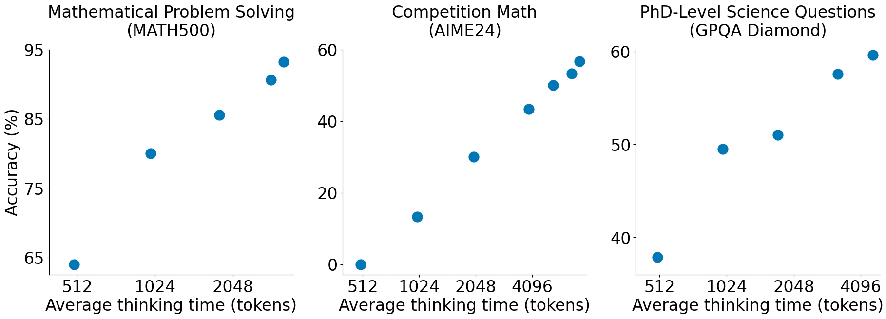

<div align="center">
  <h1>s1: Simple test-time scaling</h1>
  <p>Minimal recipe for test-time scaling and strong reasoning performance matching o1-preview with just 1,000 examples & budget forcing
 </p>
</div>
<br>



This repository provides an overview of all resources for the paper ["s1: Simple test-time scaling"](https://arxiv.org/abs/2501.19393).

- [Artifacts](#artifacts)
- [Structure](#structure)
- [Inference](#inference)
  - [vLLM](#vllm)
  - [vLLM with budget forcing](#vllm-with-budget-forcing)
  - [transformers](#transformers)
- [Training](#training)
- [Evaluation](#evaluation)
- [Data](#data)
- [Visuals](#visuals)
- [Known Issues](#known-issues)
- [Citation](#citation)

### Artifacts

- **Paper**: https://arxiv.org/abs/2501.19393
- **Model**: https://hf.co/simplescaling/s1-32B
- **Data**: https://hf.co/datasets/simplescaling/s1K
    - s1-prob: https://hf.co/datasets/simplescaling/s1-prob
    - s1-teasers: https://hf.co/datasets/simplescaling/s1-teasers
    - Full 59K: https://hf.co/datasets/simplescaling/data_ablation_full59K

### Structure

- `eval/`: Evaluation scripts
- `data/`: Synthetic data creation scripts & co
- `train/`: Training scripts

### Inference

#### vLLM

Install the `vllm` library and run:
```python
from vllm import LLM, SamplingParams
model = LLM(
    "simplescaling/s1-32B",
    tensor_parallel_size=2,
)
tok = AutoTokenizer.from_pretrained("simplescaling/s1-32B")

stop_token_ids = tok("<|im_end|>")["input_ids"]

sampling_params = SamplingParams(
    max_tokens=32768,
    min_tokens=0,
    stop_token_ids=stop_token_ids,
)

prompt = "How many r in raspberry"
prompt = "<|im_start|>system\nYou are Qwen, created by Alibaba Cloud. You are a helpful assistant.<|im_end|>\n<|im_start|>user\n" + prompt + "<|im_end|>\n<|im_start|>assistant\n"

o = model.generate(prompt, sampling_params=sampling_params)
print(o[0].outputs[0].text)
```

#### vLLM with budget forcing

```python
from vllm import LLM, SamplingParams
from transformers import AutoTokenizer

# Decide on a token limit for thinking; As the model's max tokens is 32768, 32000 usually ensures there is enough space for the model to still answer
MAX_TOKENS_THINKING = 32000
# Decide how often to ignore end-of-thinking token
NUM_IGNORE = 1

model = LLM(
    "simplescaling/s1-32B",
    tensor_parallel_size=2,
)
tok = AutoTokenizer.from_pretrained(
    "simplescaling/s1-32B"
)

stop_token_ids = tok("<|im_end|>")["input_ids"]
sampling_params = SamplingParams(
    max_tokens=32768,
    min_tokens=0,
    stop_token_ids=stop_token_ids,
    skip_special_tokens=False,
    temperature=0.0,
)

# For the exact raspberry sample in the paper, change
# model to `qfq/1k_qr_bt_dm_po_steps` (an earlier version of s1)
# & prompt to `How many r in raspberry?`
prompts = [
    "How many r in raspberry",
]

for i, p in enumerate(prompts):
    prompt = "<|im_start|>system\nYou are Qwen, created by Alibaba Cloud. You are a helpful assistant.<|im_end|>\n<|im_start|>user\n" + p + "<|im_end|>\n<|im_start|>assistant\n"
    stop_token_ids = tok("<|im_start|><|im_end|>")["input_ids"]
    sampling_params = SamplingParams(
        max_tokens=MAX_TOKENS_THINKING,
        min_tokens=0,
        stop_token_ids=stop_token_ids,
        skip_special_tokens=False,
        temperature=0.0,
    )
    prompt += "<|im_start|>think"
    o = model.generate(
        prompt,
        sampling_params=sampling_params
    )
    ignore_str = "Wait"
    max_tokens_thinking_tmp = MAX_TOKENS_THINKING
    # Num of times to skip stop token
    for i in range(NUM_IGNORE):
        max_tokens_thinking_tmp -= len(o[0].outputs[0].token_ids)
        prompt += o[0].outputs[0].text + ignore_str
        sampling_params = SamplingParams(
            max_tokens=max_tokens_thinking_tmp,
            min_tokens=1,
            stop_token_ids=stop_token_ids,
            skip_special_tokens=False,
            temperature=0.0,
        )
        o = model.generate(
            prompt,
            sampling_params=sampling_params
        )
    ### Final answer ###
    prompt += o[0].outputs[0].text # You can also append "Final Answer:" here like we do for some evaluations to prevent the model from just continuing to reason in its answer when early exiting
    stop_token_ids = tok("<|im_end|>")["input_ids"]
    sampling_params = SamplingParams(
        max_tokens=32768,
        min_tokens=0,
        stop_token_ids=stop_token_ids,
        skip_special_tokens=False,
        temperature=0.0,
    )
    o = model.generate(
        prompt,
        sampling_params=sampling_params,
    )
    print("With budget forcing:")
    print(prompt + o[0].outputs[0].text)
```

#### transformers

Install the `transformers` & `torch` libraries and run:

```python
from transformers import AutoModelForCausalLM, AutoTokenizer
import torch

DEVICE = "cuda" if torch.cuda.is_available() else "cpu"
model_name = "simplescaling/s1-32B"

model = AutoModelForCausalLM.from_pretrained(
    model_name,
    torch_dtype="auto",
    device_map="auto"
)
tokenizer = AutoTokenizer.from_pretrained(model_name)

prompt = "How many r in raspberry"
messages = [
    {"role": "system", "content": "You are a helpful and harmless assistant. You are Qwen developed by Alibaba. You should think step-by-step."},
    {"role": "user", "content": prompt}
]
text = tokenizer.apply_chat_template(
    messages,
    tokenize=False,
    add_generation_prompt=True
)
model_inputs = tokenizer([text], return_tensors="pt").to(model.device)

generated_ids = model.generate(
    **model_inputs,
    max_new_tokens=512
)
generated_ids = [
    output_ids[len(input_ids):] for input_ids, output_ids in zip(model_inputs.input_ids, generated_ids)
]

response = tokenizer.batch_decode(generated_ids, skip_special_tokens=True)[0]
```

### Training

To run training, you can find our script at `train/sft.py` which you can invoke via one of the `train/sft*sh` scripts which in turn you can launch via `train/launch.sh` if you are on a SLURM cluster (requires editing the file for your cluster setup).

We provide a quick start to reproduce the results
```
git clone https://github.com/simplescaling/s1.git
cd s1
pip3 install -r requirements.txt
bash train/sft.sh
```
*Note: If you encounter an out-of-memory (OOM) issue with 8 GPUs, consider enabling gradient checkpointing by adding the following line to your script: `--gradient_checkpointing=True`.*
### Evaluation

We cloned [lm-evaluation-harness](https://github.com/EleutherAI/lm-evaluation-harness) at commit `4cec66e4e468d15789473d6d63c3a61a751fa524` and modified it. Setup:
```bash
cd eval/lm-evaluation-harness
pip install -e .[math,vllm]
```

All commands are in `eval/commands.sh`. For AIME24 we always pick the `aime24_nofigures` result, which uses a dataset that only contains the AIME24 figures if they are important for the task.

If you want to compute statistics (avg thinking tokens etc) for an evaluation run you can use 
`python eval/compute_sample_stats.py path_to_samples_file.jsonl`

All our evaluation result files are at: https://hf.co/datasets/simplescaling/results

To run REBASE: commands are in `eval/rebase/run.sh`
Note that for the evaluations in the Discussion section with REBASE we used https://huggingface.co/simplescaling/step-conditional-control-old trained on an older version of our dataset https://huggingface.co/datasets/simplescaling/s1K-step-conditional-control-old and run on an older version of our evaluation using https://huggingface.co/datasets/Maxwell-Jia/AIME_2024.

### Data

To recreate our data:
1. Run `data/collect_data.py` followed by `data/fix_gpqa.py` & `data/add_aime.py` to collect the questions; Make sure to change the hub path in the respective files to one of your own
2. ... @Zitong ...

### Visuals

All figures and some tables are created via [this colab](https://colab.research.google.com/drive/1GAfwbJs2Y1dgGGsxrQyQg2G7CRH5NgN3?usp=sharing) equivalent to `visuals/visuals.ipynb`. Some are subsequently edited via the `visuals/s1.fig` file, which you can load in Figma.

### Known Issues

- vLLM throws `ValueError: Token id XXXXX is out of vocabulary`
  - This can happen with budget forcing, especially when running with temperature 1, where the model will sometimes do crazy stuff and predict a vocab id that is larger than its max token id but still within its embedding size i.e. anything <152064, >151664; When we refeed the model's previous outputs to it which is done when setting e.g. max_thinking_tokens in the evaluation then this will cause the error cuz vLLM does this check even though it would only be an issue for IDs >152064. To fix it you can just uncomment the vLLM ValueError (It is the line `if max_input_id > tokenizer.max_token_id:` in `vllm/engine/llm_engine.py`)

### Citation

```bibtex
@misc{muennighoff2025s1simpletesttimescaling,
      title={s1: Simple test-time scaling}, 
      author={Niklas Muennighoff and Zitong Yang and Weijia Shi and Xiang Lisa Li and Li Fei-Fei and Hannaneh Hajishirzi and Luke Zettlemoyer and Percy Liang and Emmanuel Candès and Tatsunori Hashimoto},
      year={2025},
      eprint={2501.19393},
      archivePrefix={arXiv},
      primaryClass={cs.CL},
      url={https://arxiv.org/abs/2501.19393}, 
}
```
